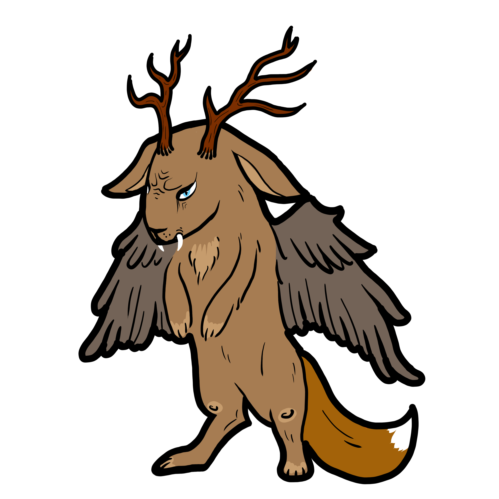
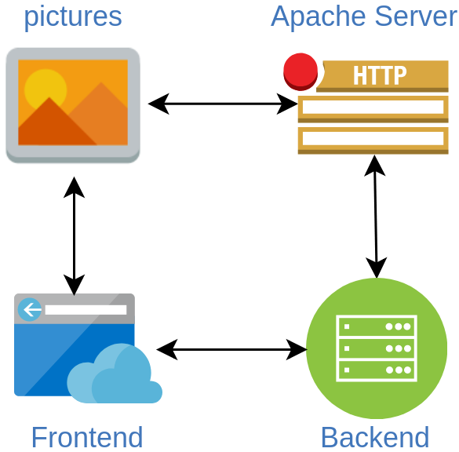

#  Wolpertinger
### Microservice to order custom shirts :shirt:

Users can design custom shirts with multiple pictures in three different sizes.
Orders will be sent to the configured email addresses.

Available pictures can be found [here](wolpertinger-apache/images).

### Project setup
The [Vue.js frontend](wolpertinger-vue) communicates with the backend ([Java](wolpertinger-java)) via Rest-API.
The backend provides links to the pictures on an [Apache HTTP server](wolpertinger-apache) which the frontend can display.



For each successful order an email to configured recipients will be sent via Gmail-SMTP.
### Deploy project
```
./deploy.sh
```
Builds projects and starts docker containers.