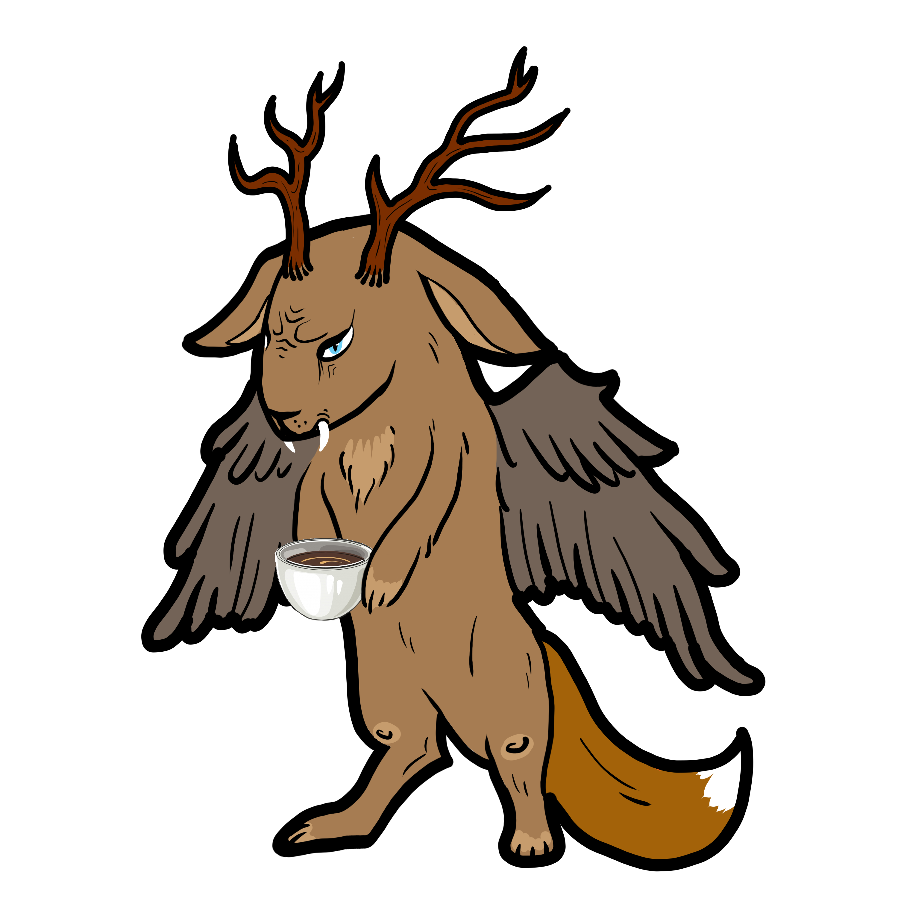

#  Wolpertinger
### Microservice to order custom shirts :shirt:
This is the JavaEE backend for the wolpertinger project.

## Project setup
The project is built with maven and deployed in docker containers.

### Build the .war
```
mvn -U clean package -DskipTests
```

### Start docker containers
```
docker-compose up --build -d
```

## Rest-API access
OpenAPI documentation: `{deployUrl}/openapi`

### Image service
GET all: `{deployUrl}/wolpertinger-java/rest/images`

GET by name: `{deployUrl}/wolpertinger-java/rest/images?name={imageName}`

### Order service
GET all: `{deployUrl}/wolpertinger-java/rest/orders`

GET by id: `{deployUrl}/wolpertinger-java/rest/orders/{id}`

POST to create: `{deployUrl}/wolpertinger-java/rest/orders`