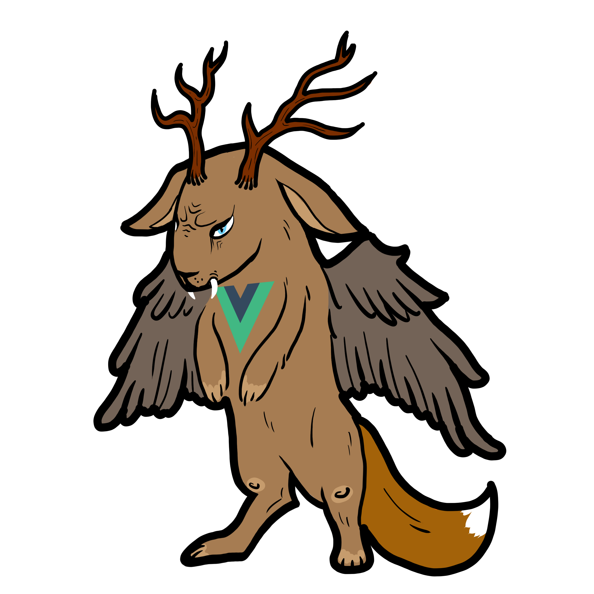

#  Wolpertinger
### Microservice to order custom shirts :shirt:
This is the Vue.js frontend for the wolpertinger project.

## Install dependencies and build project
in `wolpertinger-vue/app`:

```
npm install
npm run build
```

### Start docker
in `wolpertinger-vue`:

```
docker-compose.yml up --build -d
```
